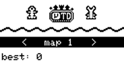

# MicroTD

This is a Tower Defense game for Arduboy.

License: CC0

ideas for derivative work:

- Make a mod where you can build towers during a wave in progress.
- Make more maps (there's still plenty room for more in the ROM).
- Make procedural generation of maps (based on given seed so that you can share/replay).
- Make this a game with campaign (progression through levels increasing in difficulty).
- Make this CLI PC game, e.g. with ncurses. Just rewrite the init/loop stuff for PC.
- Port this to other platforms (Pokitto, Gamebuino, ...).
