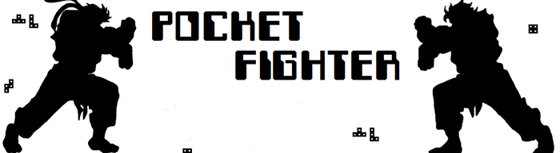
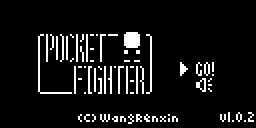
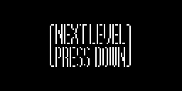
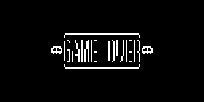
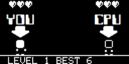
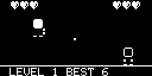

# Pocket Fighter

**Copyright (C) 2017 [Wang Renxin](https://github.com/paladin-t/). All rights reserved.**

 for the precompiled .HEX, and the .ARDUBOY package.

 for the source code.

## Introduction

Pocket Fighter is an FTG, you can compete with your Arduboy. The CPU will repeat your actions at previous level.

## Installation

### 1. Use the precompiled

* Use an Arduboy uploader to upload the `/out/pocket_fighter.hex` to your Arduboy.
* Or use an Arduboy manager to upload the `/out/pocket_fighter.arduboy` package.

### 2. Use the sketch

* Make sure you have the Arduino IDE installed and the Arduboy board package installed and selected.
* Open the `/pocket_fighter/pocket_fighter.ino` sketch with the Arduino IDE.
* Compile and upload it.

## Control

D-Pad: Left/Right/Up

	Move and jump

D-Pad: Down

	Enter next level if win, or to the menu after game over

A

	Punch

B

	Hadouken

## Rules

1. You are always playing the **bright head**, your opponent is the dark head.
2. Both fighters get up to 3 HP, one will die when all HP lost.
3. You will enter to next level and get 1 more HP, if the opponent is defeated.
4. The CPU will **repeat your actions at previous level**.
5. Defeat your challengers, and survive as long as you can.
