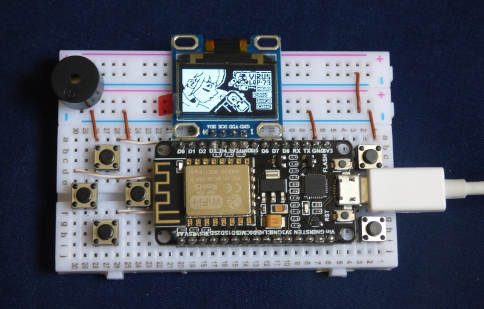
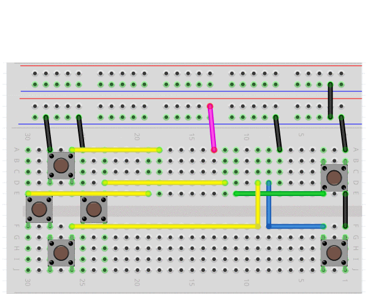

# ESP8266 port of the Arduboy2 library

This port of the Arduboy2 library compiles for the ESP8266, existing Arduboy2-compatible games like CastleBoy by TeamARG can use it as a drop-in replacement for the original Arduboy2 library, other games such as Squario or Virus LQP-79 run with slight modifications, but hopefully they will run natively in future releases.

# Usage

Simply replace the Arduboy2 library in your Arduino Studio libraries folder with this version.

# Hardware

The library was tested on a NodeMCU module with a ESP-12N (yes, N) microcontroller.
It requires an SSD1306 based OLED module, the pinout should match the pictures if you want to place it on the breadboard right beside the ESP8266.

# Bill of Materials

As stated earlier, the goal is to get to USD $5 per unit, shipped. If you order the parts from Amazon, the bill comes to around $30, but you can get enough parts for 4 consoles from AliExpress for $20, not including the battery circuitry, but a triple AA holder connected to the pins Vin and GND will do the trick for a few more cents on the same site.

The following file contains a sample of the items you need to buy, I did NOT buy from them, they are not endorsing me, nor do I warranty that the parts will work together or at all.

https://github.com/edgarborja/Arduboy2ESP/blob/master/AliExpressBillOfMateriasl.pdf

# Motivation

I wanted to build the simplest (and cheapest) portable and programmable game console, so that new tinkerers can have an accessible experience of putting it together, and experience the thrill that I felt when I started editing gorilla.bas and nibbles.bas in DOS in the early 90's.

After looking around, I found the awesome Arduboy project, and the community it generated, which inspired me to join that effort and contribute if possible. 

# Credits and Documentation

99% of the work on the library was done by the contributors to the following repositories:

https://github.com/Arduboy/Arduboy 

https://github.com/MLXXXp/Arduboy2

https://github.com/harbaum/Arduboy2 

https://github.com/hartmann1301/Arduboy2 hartmann1301 migrated the library to the ESP8266 platform, from there just a few tweaks were needed.

Please do read through the extensive documentation included there.

# Contributions and Disclaimer

Contributions to the documentation, code or electronics are welcome, I am not pretending to be an expert in C or in electrical engineering, use the library and the circuits presented above at your own risk.
